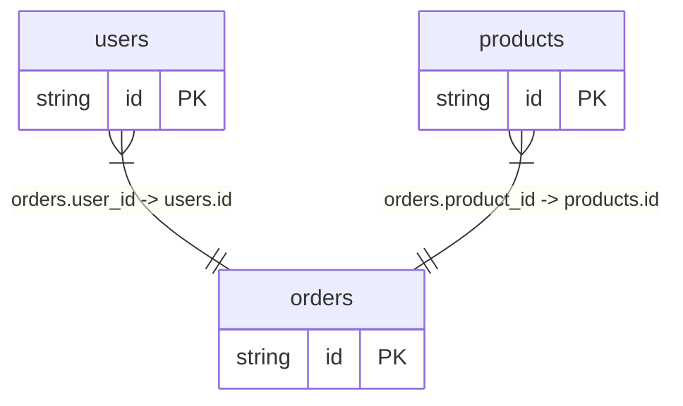
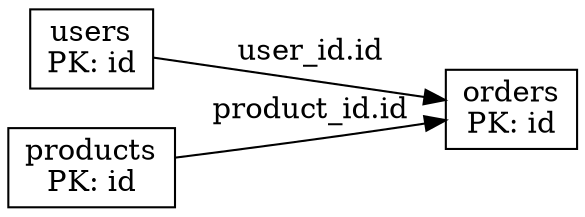

# LiteSchema — SQLite Schema Analysis & Migration CLI

A comprehensive Go CLI tool for parsing, diffing, migrating, analyzing, validating, and querying SQLite database schemas and data.

## Features

- **Parse** — Extract full schema from SQL files, JSON dumps, or live `.db`/`.sqlite` files
- **Diff** — Semantic comparison of two schemas (added/removed/modified tables, columns, indexes, views, triggers)
- **Migrate** — Auto-generate ALTER TABLE migration SQL from schema diffs
- **Analyze** — Index health analysis (redundant indexes, missing FK indexes, over-indexed tables)
- **Validate** — Check for common schema issues (missing PKs, orphaned FKs, naming issues)
- **FK Graph** — Visualize foreign key dependency chains with ASCII, Mermaid, or Graphviz DOT
- **Query** — Execute SQL queries on live databases with formatted output (table, JSON, CSV)
- **Profile** — Data profiling with column statistics, histograms, and value distributions
- **Export** — Export table data to JSON, CSV, or SQL INSERT statements

## Installation

### From source

```bash
git clone https://github.com/EdgarOrtegaRamirez/liteschema.git
cd liteschema
go build -o liteschema ./cmd/liteschema
```

### Go install

```bash
go install github.com/EdgarOrtegaRamirez/liteschema/cmd/liteschema@latest
```

## Quick Start

```bash
# Parse a SQL schema file
liteschema parse schema.sql

# Parse with CREATE statements visible
liteschema parse schema.sql --show-sql

# Parse a live SQLite database
liteschema parse data.db

# Diff two schema versions
liteschema diff schema_v1.sql schema_v2.sql

# Generate migration SQL
liteschema migrate schema_v1.sql schema_v2.sql --format sql

# Analyze indexes
liteschema analyze schema.sql

# Validate schema
liteschema validate data.db

# View foreign key dependency graph (ASCII, Mermaid, or DOT)
liteschema fkgraph schema.sql
liteschema fkgraph data.db --format mermaid
liteschema fkgraph data.db --format dot

# Execute SQL queries with formatted output
liteschema query data.db "SELECT * FROM users"
liteschema query data.db "SELECT name, email FROM users" --format json
liteschema query data.db --file query.sql

# Profile a table with statistics and histograms
liteschema profile data.db orders
liteschema profile data.db --format json

# Export table data
liteschema export data.db users --format json --limit 10
liteschema export data.db users --format csv
liteschema export data.db orders --format sql --limit 5
```

## Commands

| Command | Description |
|---------|-------------|
| `parse` | Parse and display a SQLite schema from SQL, JSON, or database file |
| `diff` | Compute semantic schema diff between two files |
| `migrate` | Generate ALTER TABLE migration SQL from schema diff |
| `analyze` | Analyze indexes for redundancy and missing coverage |
| `validate` | Validate schema for common issues |
| `fkgraph` | Display foreign key dependency graph (ASCII / Mermaid / DOT) |
| `query` | Execute SQL queries with formatted table, JSON, or CSV output |
| `profile` | Show table statistics and data profiling |
| `export` | Export table data to JSON, CSV, or SQL INSERT statements |
| `help` | Show usage information |

## Options

| Option | Description |
|--------|-------------|
| `--format text\|json\|markdown\|sql\|mermaid\|dot\|csv` | Output format (default: text) |
| `--show-sql` | Include CREATE statements in schema view |
| `--file <path>` | Read SQL from file (query command) |
| `--output <file>` | Write output to file (export command) |
| `--limit <n>` | Limit number of rows (export command) |

## Output Formats

### Schema — Text (default)
```
┌─ TABLE: users
│  ├─ id  INTEGER  [PK, NOT NULL, AUTOINCREMENT]
│  ├─ name  TEXT  [NOT NULL]
│  ├─ email  TEXT  [UNIQUE]
┌─ TABLE: posts
│  ├─ id  INTEGER  [PK]
│  ├─ user_id  INTEGER  [NOT NULL]
│  ├─ title  TEXT  [NOT NULL]
│  ├─ FK: user_id → users(id)
```

### Schema — JSON
```json
{
  "tables": [
    {
      "name": "users",
      "columns": [{"name": "id", "type": "INTEGER", "primary_key": true}]
    }
  ]
}
```

### FK Graph — ASCII
```
Table Relationships
============================================================

┌─ orders  [PK: id]
│  user_id → users.id
│  product_id → products.id
└───────────────────────────────────────────────────────────

┌─ users  [PK: id]
│  (no outgoing foreign keys)
└───────────────────────────────────────────────────────────

Total: 3 tables, 2 foreign key relationships
```

### FK Graph — Mermaid


### FK Graph — Graphviz DOT


### Query — Table output
```
ID  NAME     EMAIL
--  ----     -----
1   Alice    alice@example.com
2   Bob      bob@example.com

(2 rows)
```

### Query — JSON output
```json
[
  {"id": 1, "name": "Alice", "email": "alice@example.com"},
  {"id": 2, "name": "Bob", "email": "bob@example.com"}
]
```

### Profile — Column statistics with histogram
```
Table: orders
Rows: 5
Columns: 5

  id (INTEGER)
    Count: 5  Nulls: 0  Distinct: 5
    Min: 1  Max: 5  Avg: 3.00
    Histogram:
                [1.0, 1.4) | #################### (1)
                ...
```

### Export — SQL INSERT
```sql
INSERT INTO users (id, name, email) VALUES (1, 'Alice', 'alice@example.com');
INSERT INTO users (id, name, email) VALUES (2, 'Bob', 'bob@example.com');
```

## Architecture

```
cmd/liteschema/        # CLI entry point with subcommands
pkg/schema/            # Core schema library
├── models.go          # Data types (Table, Column, Index, etc.)
├── parser.go          # SQL and database schema parser
├── printer.go         # Text/JSON/Markdown/SQL output formatters
├── diff.go            # Semantic schema diff engine
├── analyze.go         # Index analysis, FK graph, validation
├── stats.go           # Column/table statistics and profiling
└── schema_test.go     # Comprehensive test suite
pkg/sqlite/            # SQLite database engine wrapper
├── engine.go          # DB connection, queries, metadata
└── engine_test.go     # Tests with in-memory SQLite
pkg/export/            # Data export (JSON, CSV, SQL)
├── export.go          # Export functions
└── export_test.go     # Tests for all export formats
pkg/viz/               # Relationship graph visualization
├── viz.go             # ASCII, Mermaid, DOT renderers
└── viz_test.go        # Tests for graph visualization
```

## Testing

```bash
# Run all tests
go test ./... -v

# Run specific package tests
go test ./pkg/schema/ -v
go test ./pkg/sqlite/ -v
go test ./pkg/export/ -v
go test ./pkg/viz/ -v
```

60+ tests covering: SQL parsing, schema diffing, migration generation, foreign key graph construction, cycle detection, index analysis, schema validation, output formatting, database operations, data export, and relationship visualization.

## Security

- No hardcoded secrets or tokens
- Environment variables for sensitive configuration
- Input validation for all CLI arguments
- Safe file operations (no path traversal vulnerabilities)
- `.env.example` included for environment setup
- Proper error handling with meaningful messages

## License

MIT
